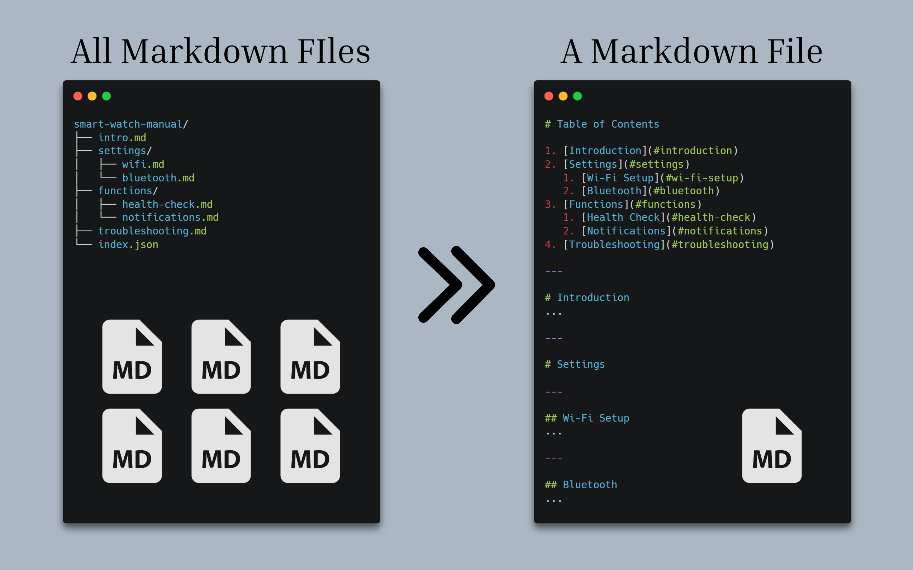
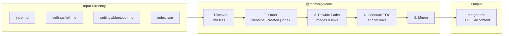
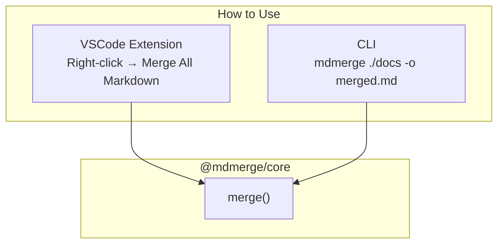

# Markdown Merge



Merge multiple Markdown files from a directory into a single document with auto-generated table of contents and relative path correction.

## Features

- **Directory merging** -- Select a folder and merge all `.md` files into one document
- **File ordering** -- Sort by filename, creation date, or custom order via `index.json`
- **Auto-generated TOC** -- Inserts a nested table of contents with anchor links
- **Heading hierarchy** -- Subdirectory structure maps to heading levels automatically
- **Path correction** -- Rewrites relative paths (images, links) so they work after merging
- **Ignore patterns** -- Exclude files using glob patterns (`--ignore "draft-*" "archive/**"`)

## How It Works





## Installation

### VSCode Extension

Search for **"Markdown Merge"** in the Extensions panel, or install from the [VS Code Marketplace](https://marketplace.visualstudio.com/items?itemName=yuk6ra.mdmerge-vscode).

### CLI

```bash
npm install -g mdmerge
```

## Usage

### VSCode

1. Right-click a folder in the Explorer
2. Select **"Merge All Markdown"**
3. Choose an ordering strategy (filename / created / index)
4. Choose where to save the output

### CLI

```bash
# Basic usage (filename order, with TOC)
mdmerge ./docs

# Save to a file
mdmerge ./docs -o merged.md

# Use index.json for custom ordering
mdmerge ./docs -o merged.md --order index

# Ignore specific files
mdmerge ./docs -o merged.md --ignore "merged.md" "draft-*"

# Disable TOC and offset headings by 1 level
mdmerge ./docs -o merged.md --no-toc --heading-offset 1
```

### CLI Options

| Option | Description | Default |
|--------|-------------|---------|
| `-o, --output <file>` | Output file path | stdout |
| `--order <strategy>` | `filename`, `created`, or `index` | `filename` |
| `--no-toc` | Disable table of contents | `false` |
| `--no-recursive` | Do not recurse into subdirectories | `false` |
| `--separator <string>` | Section separator | `\n---\n\n` |
| `--heading-offset <n>` | Additional heading level offset | `0` |
| `--ignore <patterns...>` | Glob patterns to exclude | none |

## Examples

### Example 1: Smart Watch Manual (custom order with `index.json`)

```
smart-watch-manual/
├── intro.md
├── settings/
│   ├── wifi.md
│   └── bluetooth.md
├── functions/
│   ├── health-check.md
│   └── notifications.md
├── troubleshooting.md
└── index.json
```

```json
{
  "order": [
    "intro.md",
    "settings/wifi.md",
    "settings/bluetooth.md",
    "functions/health-check.md",
    "functions/notifications.md",
    "troubleshooting.md"
  ]
}
```

Running `mdmerge ./smart-watch-manual --order index` produces:

```markdown
# Table of Contents

1. [Introduction](#introduction)
2. [Settings](#settings)
   1. [Wi-Fi Setup](#wi-fi-setup)
   2. [Bluetooth](#bluetooth)
3. [Functions](#functions)
   1. [Health Check](#health-check)
   2. [Notifications](#notifications)
4. [Troubleshooting](#troubleshooting)

---

# Introduction
...

---

# Settings

---

## Wi-Fi Setup
...

---

## Bluetooth
...

---

# Functions

---

## Health Check
...
```

Subdirectories (`settings/`, `functions/`) automatically become section headings, and files inside them are nested one level deeper.

### Example 2: Hokkaido Trip (filename order with numbered prefixes)

```
hokkaido-trip/
├── 01_flight-info.md
├── 02_hotel.md
├── 03_schedule/
│   ├── day1-sapporo.md
│   └── day2-otaru.md
└── 04_packing-list.md
```

Running `mdmerge ./hokkaido-trip` produces:

```markdown
# Table of Contents

1. [Flight Info](#flight-info)
2. [Hotel](#hotel)
3. [03 Schedule](#03-schedule)
   1. [Day 1 -- Sapporo](#day-1-sapporo)
   2. [Day 2 -- Otaru](#day-2-otaru)
4. [Packing List](#packing-list)

---

# Flight Info
...

---

# Hotel
...

---

# 03 Schedule

---

## Day 1 -- Sapporo
...

---

## Day 2 -- Otaru
...

---

# Packing List
...
```

Numbered prefixes (`01_`, `02_`, ...) control the order naturally with filename sorting. The `03_schedule/` directory appears in its correct position between hotel and packing list.

## Configuration

### index.json

Place an `index.json` in the target directory to control file order:

```json
{
  "order": [
    "intro.md",
    "settings/wifi.md",
    "settings/bluetooth.md",
    "troubleshooting.md"
  ],
  "exclude": ["draft.md"]
}
```

Files listed in `order` appear first in that order. Unlisted files are appended alphabetically.

### Heading Hierarchy

When merging a directory with subdirectories, the folder structure automatically maps to heading levels:

```
docs/               → (root, omitted)
├── intro.md        → # Introduction         (depth 0 → H1)
├── guides/         → # Guides               (directory → H1)
│   ├── setup.md    → ## Setup               (depth 1 → H2)
│   └── advanced/   → ## Advanced            (directory → H2)
│       └── api.md  → ### API Reference      (depth 2 → H3)
└── faq.md          → # FAQ                  (depth 0 → H1)
```

Flat directories (no subdirectories) behave the same as before -- all files stay at H1.

## Project Structure

This is a monorepo with three packages:

```
packages/
├── core/     # @mdmerge/core -- Pure merge logic (discover, order, paths, toc)
├── cli/      # mdmerge -- CLI wrapper using commander
└── vscode/   # mdmerge-vscode -- VSCode extension
```

## Development

```bash
# Install dependencies
npm install

# Build all (core → cli → vscode)
npm run build --workspaces

# Run tests (46 tests)
npm run test --workspace=packages/core
```

See [CONTRIBUTING.md](CONTRIBUTING.md) for detailed development guide.

## License

[MIT](LICENSE)
